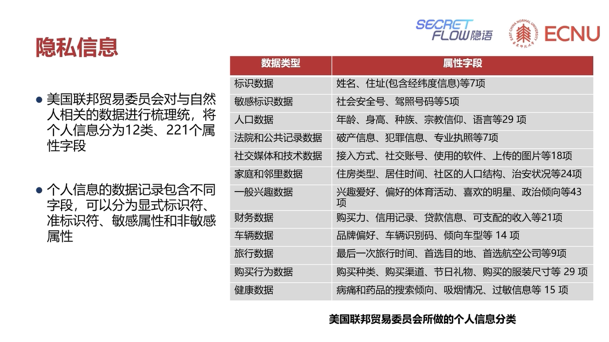
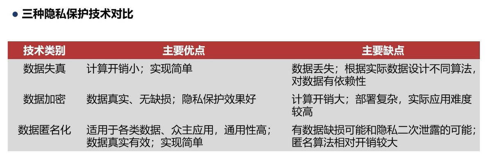

# 数据与隐私安全

> author: Liuhunck
>
> date: 2025.5.7

## 大数据与其隐私风险

大数据的3V特性：Variety（多样），Volume（海量），Velocity（高速）

数据是新能源，数据是一种新的生产要素。

数据隐私泄露问题层出不穷。

## 数据隐私与隐私保护

数据的生命周期：生产，存储，使用，分享，存档，销毁。

个人信息：识别特定自然人的各种信息。

### 隐私信息

个体的满足某些特定条件的**属性**

- 可以标识个体身份
- 泄露后会给个体造成损失
- 属于个人数据
- 如果群体信息能定位到个人，也属于隐私数据

**属性**分类：

- 显示标识符
- 准标识符
- 敏感属性
- 非敏感属性
- 背景知识

具体分类：

隐私保护需要考虑：

- 数据应用过程中不泄露隐私
- 更有利与数据的应用

隐私保护技术：

- 数据失真，原始数据扰动
- 数据加密
- 数据匿名化

#### 隐私计算与人工智能

人工智能的基石是数据

数据是宝贵的，不易收集

## 总结

**隐私计算广义定义：在保护数据隐私的同时实现计算任务**

保证数据在流通和融合的过程中，可用不可见

