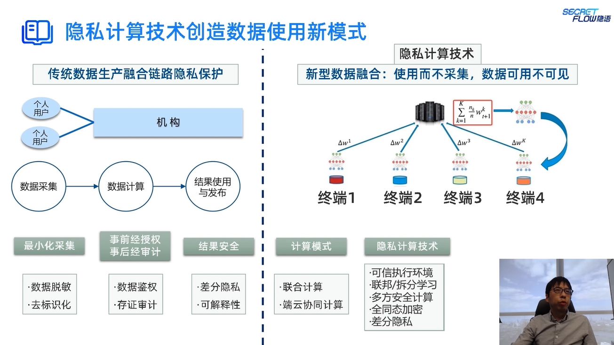

# 隐私计算的全局概览

> author: Liuhunck
>
> date: 2025.05.09

## 政策背景与应用驱动

- 十四五数字经济发展规划：初步建立数据要素市场体系
- 要素市场化配置体制机制意见：加快培育数据要素市场，加强数据资源整合和安全保护
- 更好发挥数据要素作用的意见：数据是新型生产要素，数据基础制度建设事关国家发展和安全大局

数据流通与隐私保护：

- 网络安全法，数据安全法，个人信息保护法

## 数据流通与隐私计算

数据流通的层次

- 个人数据的生产融合
- 机构数据的开放流通
- 数据价值流通市场

隐私计算基本概念

- 保护原始数据的隐私
- 计算过程中数据的隐私
    - 计算环境的安全性保障
    - 多方交互信息中不包含隐私数据信息
- 保护计算结果的隐私
    - 计算结果无法反推出原始数据信息
    - 非结果拥有方无法获取计算结果信息

对计算的正确性、保密性、安全性等进行保护

隐私计算技术创造数据使用新模式

## 隐私计算技术分类

安全模式与核心技术

- 去中心化模式：密码技术，可证明安全，MPC，FHE，ZKP
- 联合计算模式：信息泄露可度量，查分隐私，联邦学习，拆分学习
- 集中式模式：基于可信硬件，机密计算，TEE

全同态加密：BGV，BFV，TFHE，CKKS

