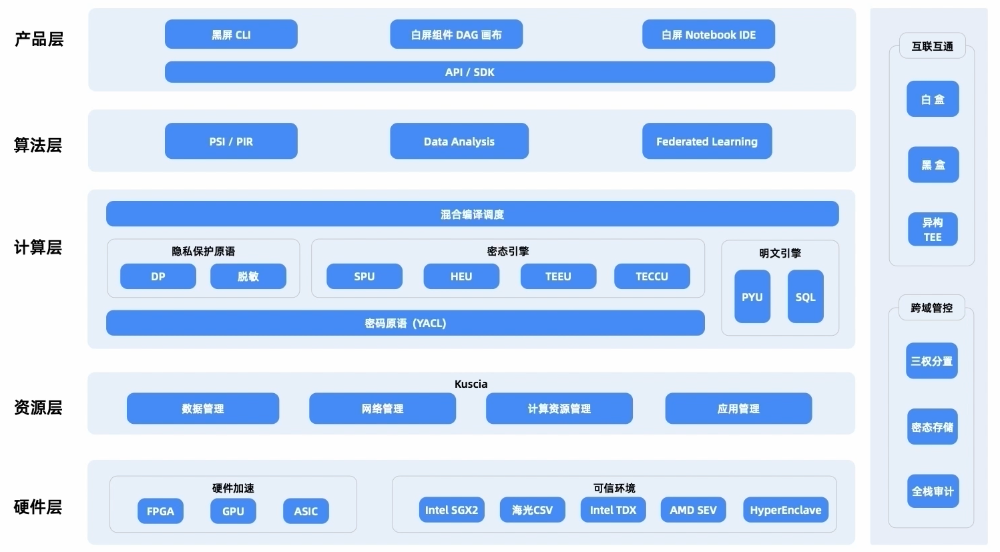

# 隐语可信隐私计算框架概览

>author: Liuhunck
>
>date: 2025.05.11

## 隐语架构一览

**隐语架构图**

## 隐语架构拆解

**隐语产品**

通过可视化产品，降低终端用户的体验和演示成本。通过模块化 API 降低技术集成商的研发成本。

**SecretPad**：轻量化安装；快速验证POC；可定制集成

多部署形态：中心模式；P2P模式

全栈产品：MPC；TEE；SCQL

SecretNote：Notebook形式；交互式建模；多节点一站式管理和交互；运行状态跟踪

