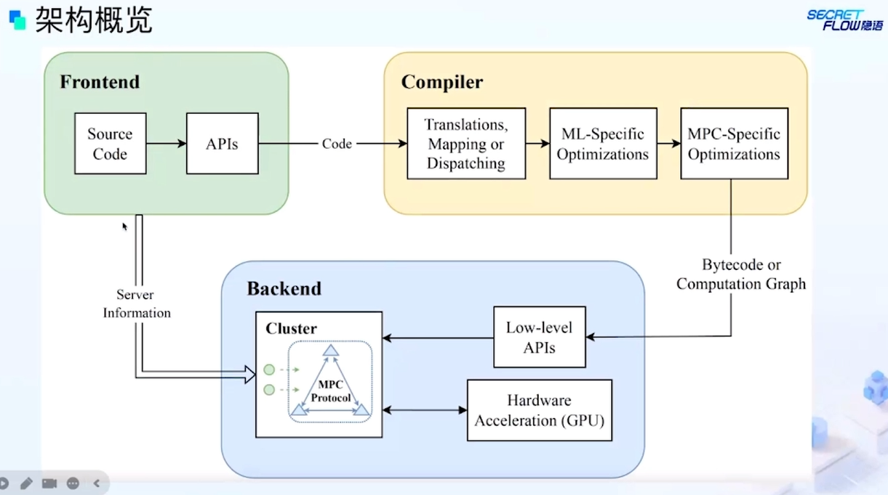
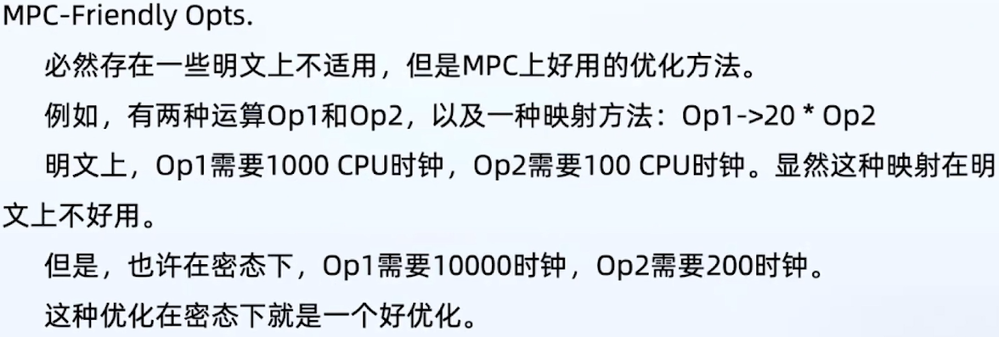

# 基于安全多方计算的隐私保护机器学习框架

> Author: Liuhunck
>
> Date: 2025.0.13

> 主讲人：段宇飞 | 清华大学

## MPC与PPML的背景

**MPC（Secure Multi-Party Computation）**：（互不信任，且不信任任何trusted party的）多方共同计算某个函数，除了各自的私有输入以及函数输出（及可从其输入和输出中推断出的信息）之外，不能获知任何额外信息。

#### **安全模型**

按照恶意参与方数量 $t$

- 诚实大多数：$t<n/2$，$t<n/3$(某些完美安全性)
- 不诚实大多数：$t>n/2$

按照敌手能力

- 半诚实敌手：遵守协议的执行，会窃取通信信息
- 恶意敌手：不遵守协议

#### MPC安全保证

- 正确性
    - 如果有输出，输出必须是正确的
- 隐私性
    - 除了私有输入和输出、其可推导的信息之外，别的信息不能泄露
- 输出保证
    - 诚实参与方需要得到输出
    - 带终止的安全：协议意识到有恶意参与方，可以提前终止协议
    - 公平性：诚实参与方得到不少于恶意参与方的信息
    - 交付保证：如论如何诚实参与方一定会得到正确的信息

#### MPC的技术

- Garbled Circuit，混淆电路
    - 优点：常数级别通信轮数
    - 缺点：电路尺寸大
    - 适用于高延迟网络环境
- Secret Sharing，秘密共享
    - 优点：通信和计算开销相对较小
    - 缺点：通信轮数和电路深度线型增长
    - 适用于低延迟网络环境

#### PPML的背景

Privacy-Preserving Machine Learning

- Outsourcing Mode
    - 数据拥有方将数据分给计算方，数据拥有方缺少计算资源
- Co-located Mode
    - 同时掌握数据和计算
- Hybrid Mode
    - 同时满足多种需求方

#### PPML目前的挑战

- 处理非线型计算非常复杂
- 数据表示方法和精度
- 可拓展性和效率：PPML系统设计思路百花齐放，但互不兼容

## 通用MPC框架结构概览

两个SOTA开源框架：**SPU**和**MP-SPDZ**

一个好的MPC框架需要：

- 友好的前端，熟悉的语法、兼容的API
- 编译系统，MPC专用优化
- 高效的后端，C/C++实现

## 调研SPU和MP-SPDZ

**Multi-Protocol SPDZ（MP-SPDZ）**

- 前端

    - 一种类似Python的语言

    - 提供大多数必要的数据类型

- 编译器
    - Ahead-of-Time编译模式，输出是后端VM的字节码
    - 明文的计算直接完成。任务的程序流构造成CFG，进行优化和寄存器分配优化
- 后端
    - 支持超过34个协议
    - 支持各种party数量

**Secure Processing Unit（SPU）**

- 前端
    - 直接对齐Python
    - AI开发者只需要关注I/O操作，以及常规MPC编程原则，不要轻易reveal函数
- 编译器
    - 编译高级语言到低级的MPC原语
    - 在PPHLO上施加MPC专用的优化
    - Hardware Abstraction Layer：硬件抽象层
- 后端
    - 细粒度接口

## 讨论

MP-SPDZ学术考虑，效率高，上手难

SPU工业界，模块化，可拓展性高，效率也不差

MPC编译器：发展处于初步阶段，可以使用很多传统编译器的思路

- Operation Merging，Rearrangement

隐语社区的初衷：有一个统一的标准

一个开放性问题：

