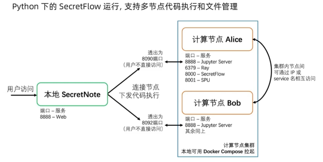
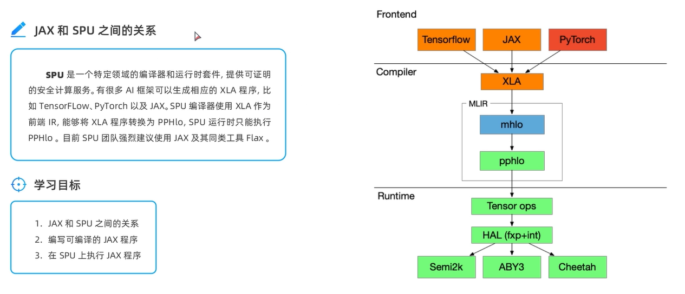
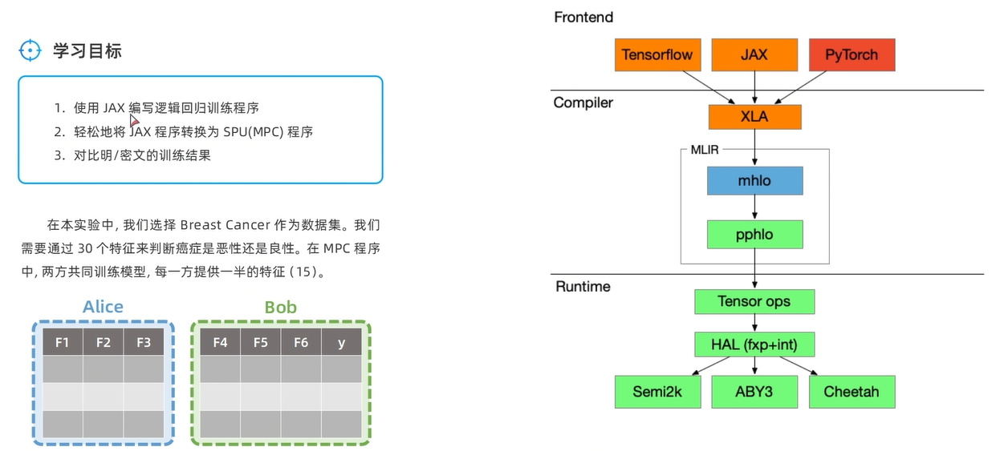

# 基于官方文档的示例验证

> Author: Liuhunck
>
> Date: 2025-05-19

作业问题：

- 在`secretnote`中下载不了`!pip install matplotlib`，并且`ping`不通外网（是要设置还是不支持？）

## 1. SecretNote简介



SecretNote部署的大致框架

## 2. SPU中使用Numpy



SPU团队强烈推荐JAX作为前端，JAX是google开源的向量计算前端，会将python代码编译成XLA用于优化

SPU将XLA编译成mhlo再变成pphlo，最后进行后端执行

```python
c = jax.xla_computation(simple_add)(np.array([[1,2],[3,4]]),4)
c.as_hlo_text()
```

将函数编译成XLA的中间表达

```python
source = sup_pb2.Computation()
source.ir_txt = c.as_serialized_hlo_module_proto()
source.input_visibility.extend([spu.Visibility.VIS_SECRET, spu.Visibility.VIS_SECRET])
source.ir_type = spu_pb2.SourceIRType.XLA

pphlo = spu.compile(source, spu_pb2.CompilerOptions())
pphlo
```

将函数编译成pphlo用于后端运行

```python
jax.jit(function)
```

jax及时编译某个函数

## 3. SPU进行逻辑回归



- 先加载数据集
- 定义训练模型，模型是自行实现的，定义了损失函数，SGD优化器，训练过程等

- 其次用JAX直接训练，用以对比

```python
alice(func)(params)
```

alice表示一个PYU，func是一个函数，params是函数传入的参数，返回在该PYU下的PYUObject

```python
sf.to(alice, W).to(device)
```

第一个to是将一个python对象到某个PYU下，第二个to是将该PYUObject传递到某个spu设备上


