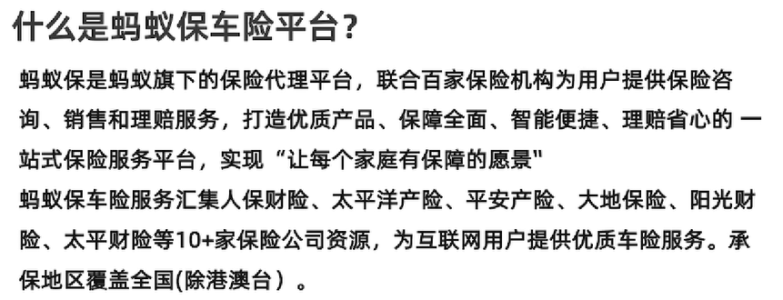
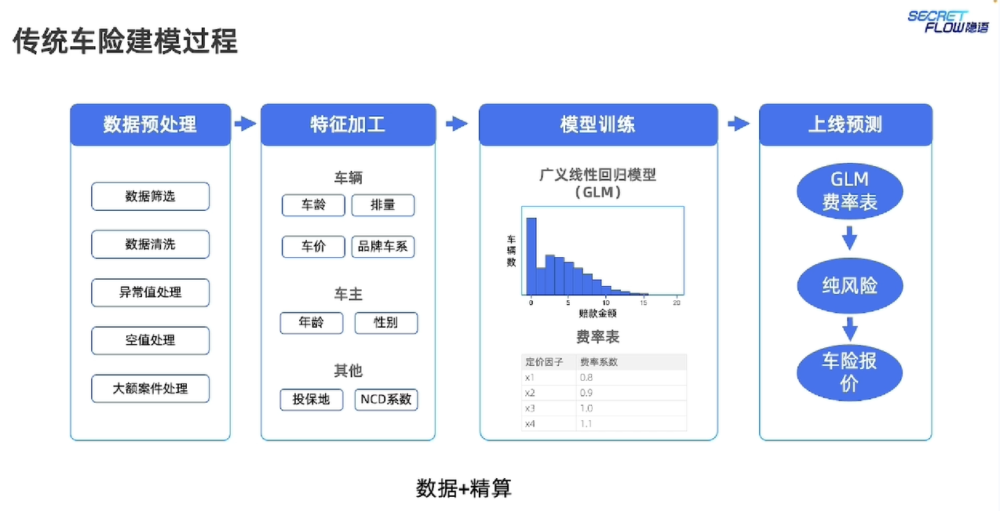
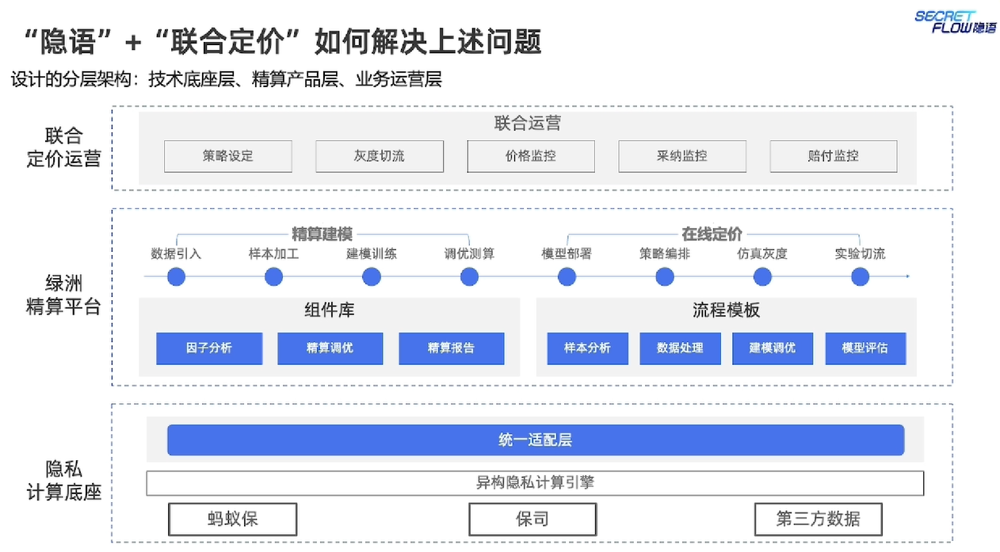
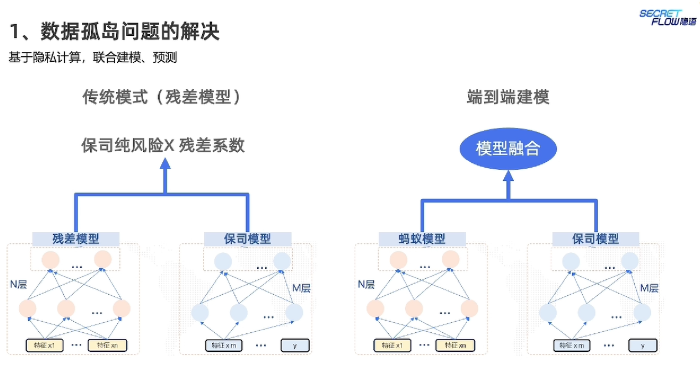
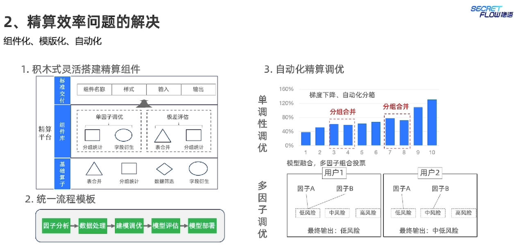
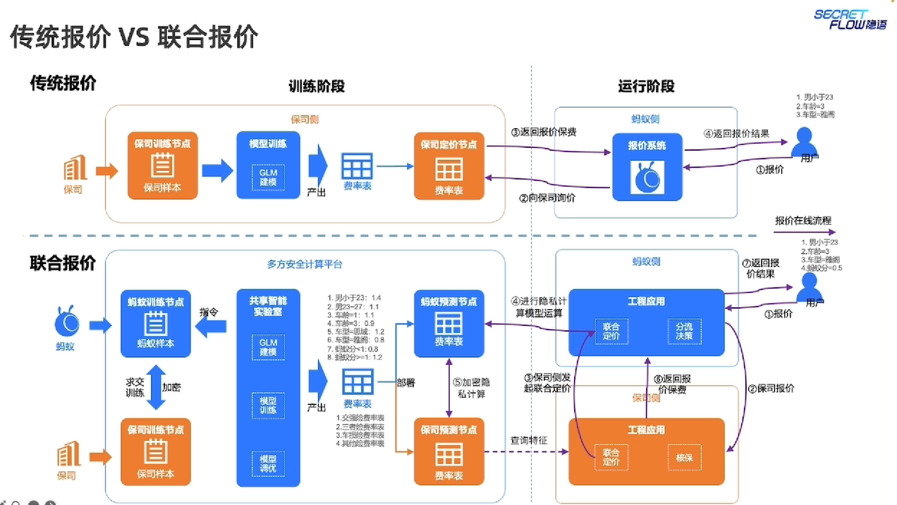
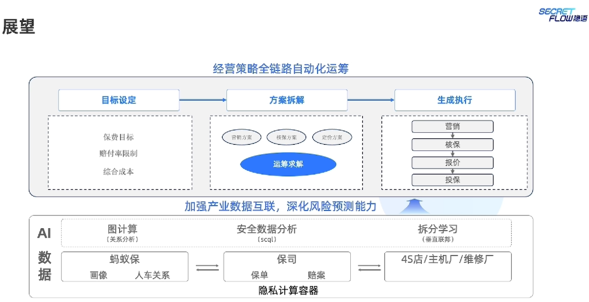

# 隐语在新能源车型的联合定价

> Author: Liuhunck
>
> Date: 2025-05-20

> 讲师：陈超|蚂蚁集团

## 新能源车险的困境

新能源车高增长，高赔付，综合成本率居高不下，普遍亏损

直接原因：车主年轻化，加速性能强，维修成本高

新能源车事故率高，修车成本高

赔付率=$\frac{赔付成本}{保费收入}$

## 蚂蚁保车险如何使用“隐语”打破困境

### 数据孤岛问题的解决

### 精算效率问题的解决

## 联合定价案例实践——车险“绿洲”平台

## 应用效果

端到端转化率80%+

UV价值提升70%+

### 展望

